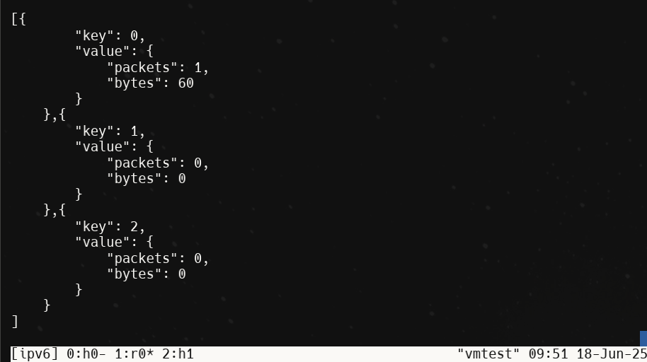
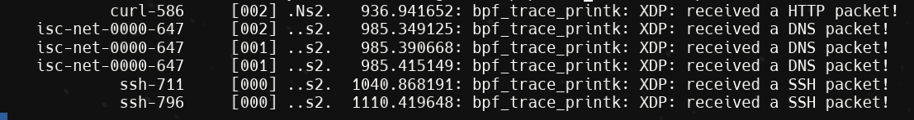

=======
# SDN final Project

# eBPF Protocol Classifier

This project implements an eBPF-based network protocol classifier that identifies and counts HTTP, DNS, and SSH traffic based on port numbers. The program runs in the Linux kernel using XDP (eXpress Data Path) to process packets at the earliest possible point in the network stack.

## Features

- Protocol Classification:
  - HTTP/HTTPS (ports 80, 443)
  - DNS (port 53)
  - SSH (port 22)

- Statistics Tracking:
  - Packet count per protocol
  - Byte count per protocol
  - Real-time logging of detected protocols

## Requirements

- Linux kernel 4.8 or newer
- LLVM/Clang compiler
- BPF Compiler Collection (BCC) tools
- Root privileges for loading the eBPF program
- `dnsutils` package to test DNS counter using `dig`

## Building
After running and entering the podman container following the [kernel-playground](https://github.com/MhrshadSh/kernel-playground/tree/master#repository-structure) repository instructions, you may find a modified version of `netprog.bpf.c` in the `src/c` folder.
the same directory also includes the `Makefile` to build the object file of the program.
1. Clean any existing build artifacts:
```bash
make clean
```

2. Build the eBPF program:
```bash
make
```

The compiled eBPF object file will be created in the `.output` directory.

3. Install the eBPF program:
```bash
make install
```

It will copy the `netprog.bpf.o` file into the `/mnt/shared` folder of the VM.

## Usage
Copy the `xdp_protocol_classifier.sh` file from `tests/scripts` folder into the `/mnt/shared` folder of the VM where the `netprog.bpf.o` exists, then run it. that will create the environment with one router and two hosts, then it applies
the following commands:

1. Load the eBPF program:
```bash
bpftool prog \
		loadall netprog.bpf.o /sys/fs/bpf/netprog/progs \
		pinmaps /sys/fs/bpf/netprog/maps
```

2. Attach the program to an interface:
```bash
bpftool net attach xdp \
		pinned /sys/fs/bpf/netprog/progs/xdp_prog_protocol_classifier dev veth1
```

3. View the trace pipe for protocol detection messages:
```bash
sudo cat /sys/kernel/tracing/trace_pipe
```

4. View protocol statistics:
```bash
bpftool map dump pinned /sys/fs/bpf/netprog/maps/protocol_stats_map
```

## Protocol Detection

The program identifies protocols based on the following ports:
- HTTP/HTTPS: Ports 80 and 443
- DNS: Port 53
- SSH: Port 22

## Statistics

The program maintains counters for each protocol type:
- Number of packets
- Total bytes

## 🧪 Tests

This section outlines how to test the protocol counter XDP program by generating traffic from `h0` to `h1`. The XDP program is attached to `r0`'s `veth1` and counts HTTP, DNS, and SSH traffic over both IPv4 and IPv6.

---

### 1️⃣ View XDP Map in Real-Time

Open the `r0` tmux window and run:

```bash
watch bpftool map dump pinned /sys/fs/bpf/netprog/maps/protocol_stats_map
```
### 2️⃣ Run Test Cases from h0

Open the h0 tmux window and use the following commands.
### 🌐 HTTP Tests
#### HTTP over IPv4
```bash
curl http://10.0.2.1 --connect-timeout 1
```
#### HTTP over IPv6
```bash
curl -g -6 'http://[beef::1]' --connect-timeout 1
```

### 🧭 DNS Tests
#### DNS over IPv4
```bash
dig @10.0.2.1 example.com
```
or use "curl example.com". As it will generate a DNS querry to resolve example.com
#### DNS over IPv6
```bash
dig @beef::1 example.com
```

### 🔐 SSH Tests
#### SSH over IPv4
```bash
ssh -o StrictHostKeyChecking=no -o ConnectTimeout=1 user@10.0.2.1
```
#### SSH over IPv6
```bash
ssh -o StrictHostKeyChecking=no -o ConnectTimeout=1 user@[beef::1]
```

---

## 📸 Experimental Screenshots

Below are the screenshots demonstrating the behavior of the Application Protocol Classifier based on eBPF/XDP with IPv6 support.

### 1️⃣ Map Before Sending Any Packets

This screenshot shows the eBPF map with initial counter values (all zero) before any packets are sent.


---

### 2️⃣ Map After One HTTP Request

After sending a single HTTP request, the HTTP counter is incremented.



---

### 3️⃣ Map After Sending DNS Traffic

This shows the counter after DNS traffic is sent.


---

### 4️⃣ Map After Sending SSH Traffic

This image shows how the SSH counter is updated after two SSH connections are initiated.


---

### 5️⃣ Output of `trace_pipe`

Real-time output from `cat /sys/kernel/tracing/trace_pipe`, showing `bpf_printk()` logs from the eBPF program detecting protocol packets.




## License

This project is licensed under the GPL-2.0 License.

## Notes

- The program processes both IPv4 and IPv6 traffic
- All packets are passed through (XDP_PASS)
- Statistics are maintained using eBPF maps
- Protocol detection is based on port numbers only 

